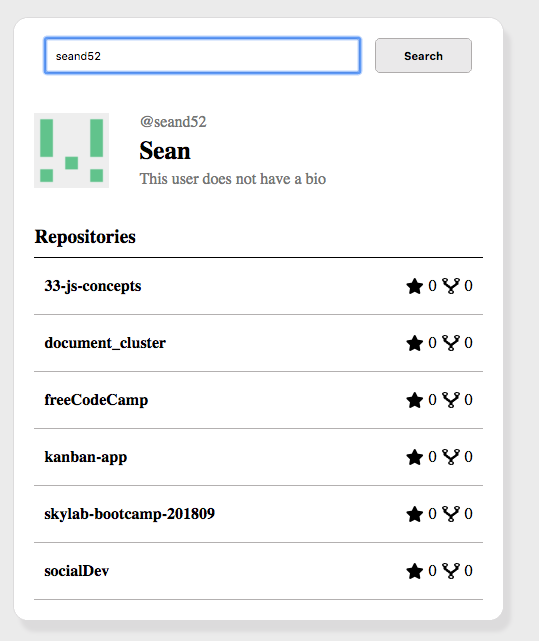
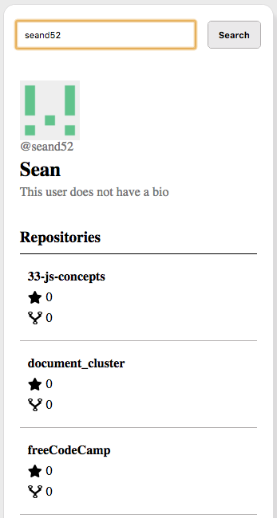

# Introduction

This is an app made for the Marfeel Front End Developer test. It uses the Github API to search user information and repositories.

# Technical Description

## Technologies used 

This application was made using vanilla javascript and CSS using the BEM naming convention. The business logic and components were tested with the Jasmine library. 

The application full reponsive and is both desktop and mobile friendly. 

## Desktop version

## Mobile version

